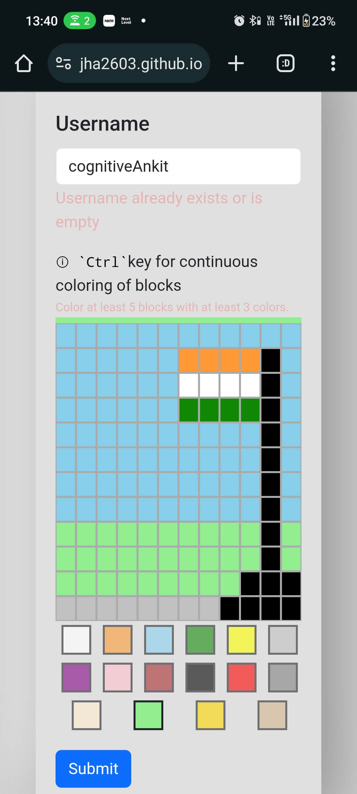
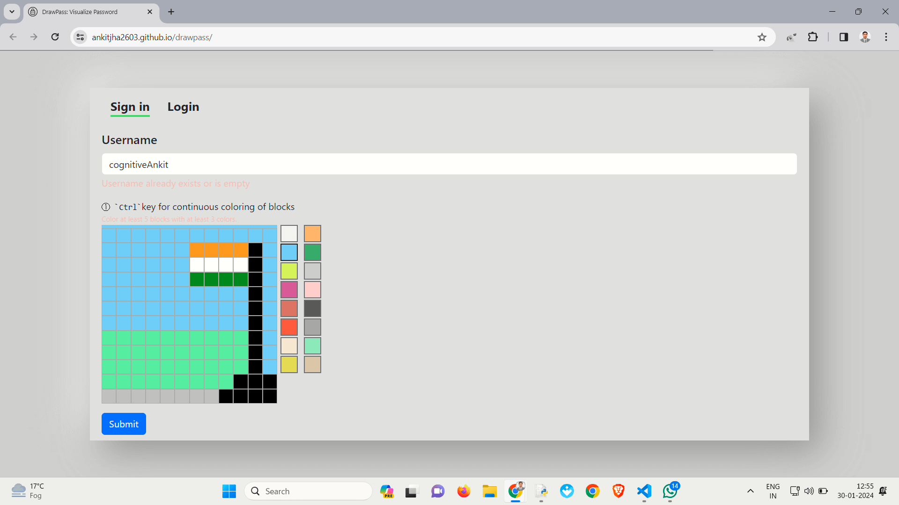
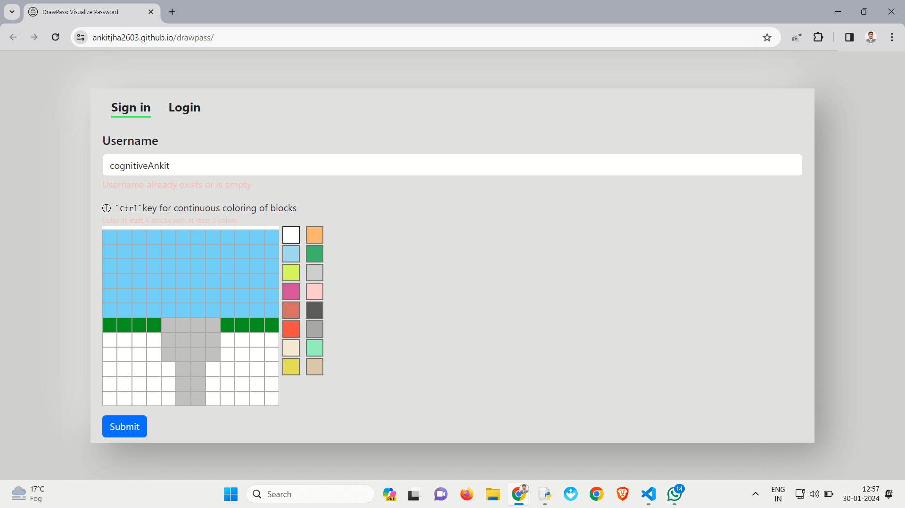
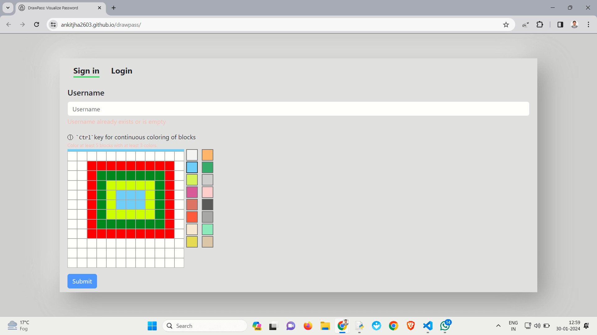
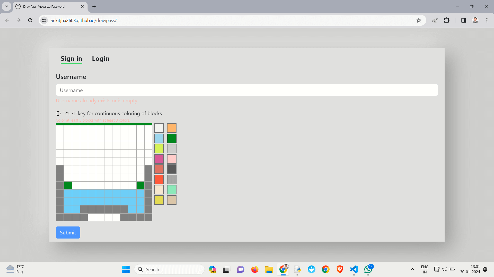
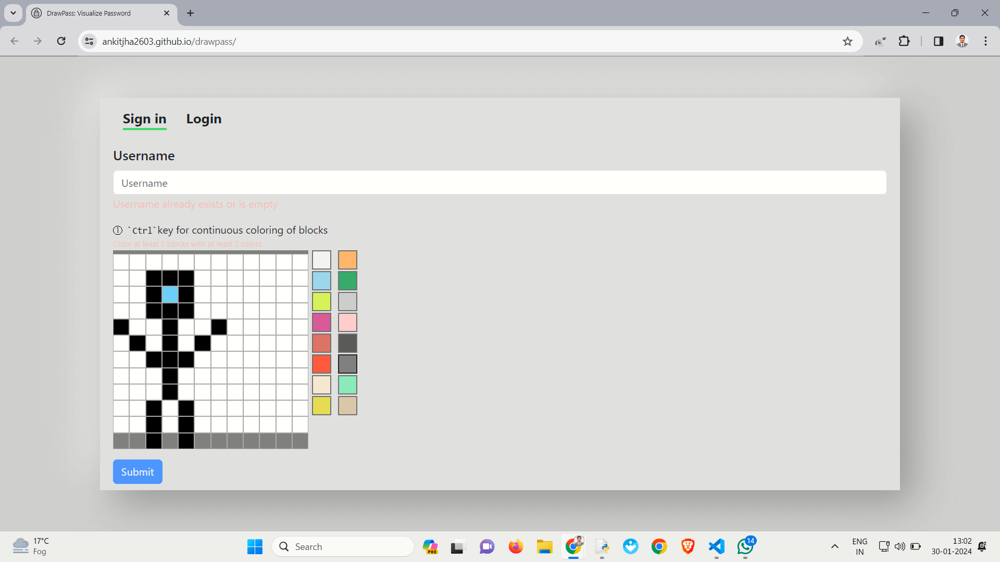
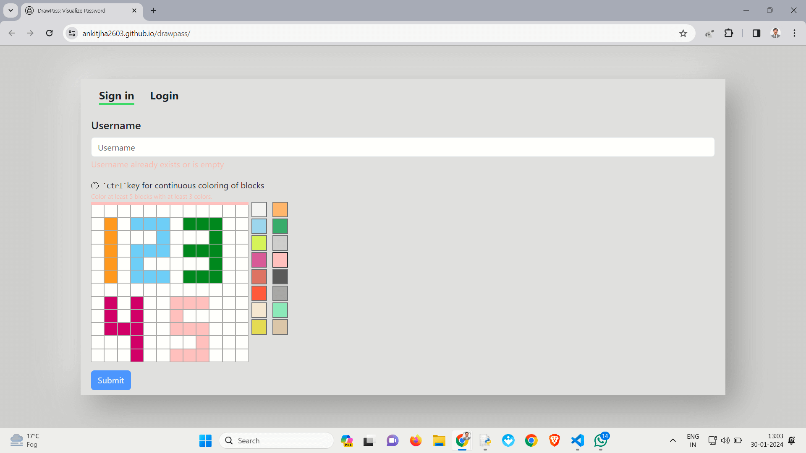
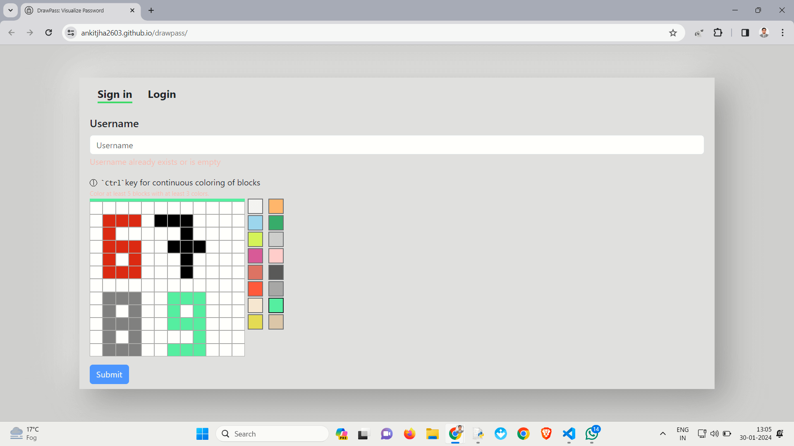
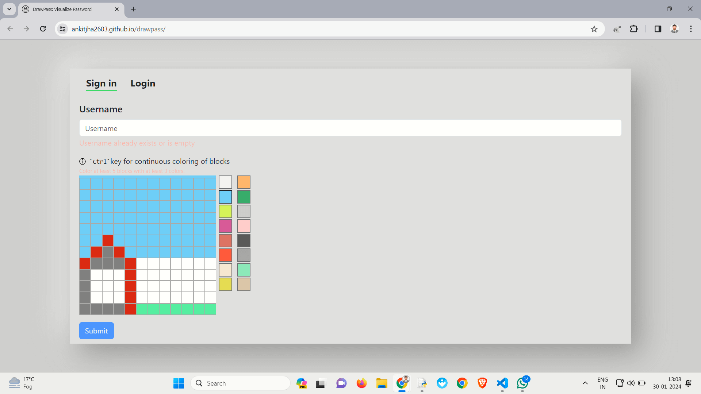
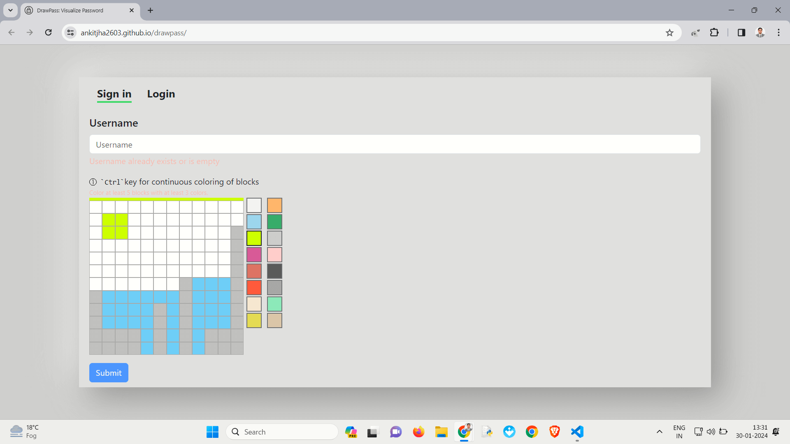

# DrawPass

**DrawPass** makes creating and remembering passwords easy by using pictures instead of complicated letters and numbers.

## Features

- **Picture Passwords:** Forget confusing combinations—choose pictures to create your passwords.
- **Easy to Remember:** Use your visual memory to make strong passwords that you won't forget.
- **Simple Interface:** Anyone can use it! No need to be a tech expert.
- **Lots of Options:** Pick from many different pictures for extra security.

</img>
</img>
</img>
</img>
</img>
</img>
</img>
</img>
</img>
</img>

### Shortcuts

- **Continuous Coloring:** Long press `Ctrl` key for continuous coloring of blocks.

## Getting Started

Get started with DrawPass by visiting
[https://ankitjha2603.github.io/drawpass/](https://ankitjha2603.github.io/drawpass/).

### Usage

Integrate this method into your project to enhance password security. Keep in mind that this is just an idea, not a ready-to-use code snippet. Additionally, consider offering users the flexibility to choose between traditional and visual password methods for added customization.

## Technologies Used

- **HTML**
- **CSS**
- **JavaScript**
- **Firebase**
- **Bootstrap**
- **Version Control:** Git (GitHub)
- **Hosting:** GitHub Pages

## Acknowledgments

- Inspired by a concept seen on an [Instagram Reel](https://www.instagram.com/p/C2dAdAZPHTD/) posted by [@mewtru](https://www.instagram.com/mewtru/). Thanks to the brilliant minds who came up with the original idea! 🌟
